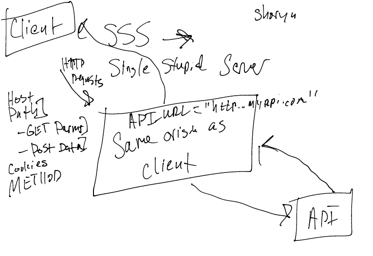
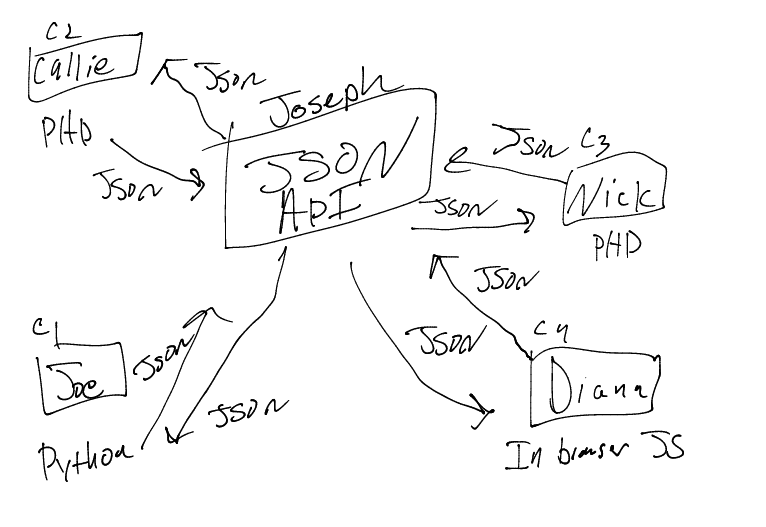

AJAX requests
=============

* Asynchronous JavaScript and XML
* Not a technology, it's a technique, a combination of techniques, not its own thing
* Synchronous = step by step
    +  More importantly, one by one. When things happen one by one, Step 3 only happens if Step 1 and Step 2 have been completed. Step 3 CANNOT HAPPEN unless Steps 1 & 2 have.
    + If you want multiple things to happen at once, they can't be synchronous
* Examples of AJAX requests
	- Content coming in real time without having to refresh the page (think Twitter or Facebook feeds)... some type of request had to be made!
* Why AJAX exists:
  - When you make a request from the browser for facebook.com, it's an HTTP request. The response is HTML, and **HTML can't do shit**.
* HTML can't do shit
  - The response is the response. It can't change.
  - There's nothing the browser can do on its own with HTML to make the page dynamic.
* But isn't PHP "dynamic"?
	- PHP is dynamic, but it's dynamically generating static content.
	- Javascript is the only way -- after you've received the HTML -- to make the page dynamic.
	- Dynamic before HTML comes back = back-end
	- Dynamic after HTML comes back = Javascript

Sooooo... what is AJAX?
-----------------------
* Data interchange	
	- HTML is a subset of XML (a set of tags and attributes). HTML limited the amount of tags that could be used.
	- Now, JSON is generally used in place of XML for data interchange.
	- Why send the front-end JSON instead of CSV or something else?
		* Every langauge right now has a way to take its native data and convert it to JSON, and take JSON and convert it to its native data. JSON is the most versatile middle man.
		* JSON isn't a language that needs an API. It's just a format that an API can choose to respond with.
		* The entire HTTP request doesn't become JSON. The HTTP request is still in its own format.
		* But the data sent to the API is in JSON format.
	- If you tried to send an associative array in PHP format to Python, Python would have no clue what to do with it. Instead of every langauge coming up with a way to convert its data to the format of every other language, we create a centrally targeted format.
	
* AJAX is performing HTTP requests.
	- AJAX is a technique to initiate HTTP requests from the browser without the need for user initiation. (<--- maybe fix that definition)
	- Basically, these HTTP requests can happen in the background.
* Examples:
  - Tweets showing up at the top of your timeline
  - Facebook feed auto downloading when you scroll to the bottom
  - chats on a website, auto-complete/search suggestions(?)
  - forms that don't refresh the page after hitting submit (but still display some sort of message).

CORS
----

* Cross-Origin Resource Sharing
	- Origin = protocol + host name + port
	-	HTTP: Port 80
	-	HTTPS: Port 443
	-	cats.com making an AJAX request to dogs.com isn't the same origin, because (obviously) it's a different host name.
* Cross-Origin is simply any request that isn't same origin (either a different protocol/port or a different host name, or both)
Why is this a big deal?
	- Because of JavaScript! JS has no isolation. Any script on a HTML doc has access exposed data of any other script on the doc. If somehow a malicious script is put on a document, then that script has access to any exposed data in any other script.
Why does CORS exist?
	- You can get sensitive data by injecting malicious script into a site and then gathering data exposed by other scripts.
	- Without CORS, JavaScript can force the initiation of any HTTP request to any domain.
	- Examples: 
		+ AJAX requests automatically bring cookies along with them, so that AJAX request might act like you.
		+ Financial transactions can be made (if you find the endpoint that initiates the transaction).
	- Without CORS, your site can be used for all these malicious reasons, without you or your users knowing about it.
* DDoS = Distributed Denial of Service Attack
	- Server can't handle incoming requests (too many)
* Dev strategy: the stupid server relay
	- Have a local backend whose sole job is to relay requests from the front end to the API
	- This allows us to keep private information (such as API keys) on the backend
	- This circumvents the CORS issue since the backend and the frontend  will reside on the same server
	

APIs
----

- Application Programming Interface
- Super broad term
- Can also commonly refer to an external service that you make HTTP requests to and get data back.
- Something that you use to perform a specific task.

Learn 2 things (to make all this less abstract)...

1. How to manually perform an HTTP request (with PHP, then with AJAX, use it through JQuery)
2. Duplicate HTTP requests. With PHP, log in to any website you want or perform any request you want.
	- Will be harder on bigger sites. Find a smaller site with a log-in of some form. Use the Chrome Network inspector to observe what is expected in that HTTP request.

* Any HTTP request that is made, there's a way to emulate it manually.
* Use the site httpbin.org - The Hello World of HTTP Requests! (use the /GET and not just the home page)
* Use the library phprequests - https://github.com/rmccue/Requests. Very easy user friendly.
